# Hi, I'm Jackson

IT senior at Mizzou, automating operations at a fiber ISP by day, and homelabbing at night.

## What I do

My job started as a scheduling problem. Fiber install jobs came in through an internal calendar and a pile of contractor emails, and someone had to read them, match them up, and assign the work by hand every day. I wrote tools to do that instead: a scraper for the calendar, parsers for each contractor's schedule format, and browser automation that pushes the assignments back into the internal system. That grew into a small suite of Dockerized Python apps with a shared browser-automation library underneath, and I maintatined that until we SAAS'd our way into a new OSS-BSS.

Now I spend by days in meetings and writing SQL queries, but I'm finishing my IT degree in the meantime, and once I graduate I want to move into a software engineering role proper. The automation work I've done has shown me quite a few things I could never have learned from classroom work alone, namely that writing the code is far from the hardest part of being an SWE.

## How I work

- Everything I've built started as something that annoyed me. I don't pick up a project to learn a framework; I pick it up because a task was slow or manual and I got tired of it.
- If I can run it myself, I will. Docker on my own hardware behind Cloudflare Tunnels beats a monthly bill and a vendor's roadmap.
- The unglamorous parts are the job. A deploy that works the same every time, tests you can trust, and a README someone else can follow matter more than the clever bit.

## Off the clock

I run a home server that hosts the sites linked above and a couple dozen other containers. Containers opt in to public access with a Docker label, and a tunnel manager I wrote discovers them and sets up the Cloudflare routes. The rest is Home Assistant and a habit of un-clouding hardware I already own: [EchoMuse](https://github.com/DaSonOfPoseidon/EchoMuse) turns old Echo Dots into local voice satellites, and [SoundSleeper](https://github.com/DaSonOfPoseidon/SoundSleeper) with [free-sleep-ha](https://github.com/DaSonOfPoseidon/free-sleep-ha) gives an Eight Sleep pod local control without the subscription.

## Projects

| Project | What it is | Built with |
|:--------|:-----------|:-----------|
| [**EchoMuse**](https://github.com/DaSonOfPoseidon/EchoMuse) | Replaces the Alexa firmware on a 2nd-gen Echo Dot with a small Go server and pairs it with a Python controller, so the Dot shows up in Home Assistant as a native voice satellite. Wake word, Assist, and TTS all run locally, and you can train your own wake words. | `Go` `Python` `Home Assistant` `openWakeWord` |
| [**CalendarBuddy**](https://github.com/DaSonOfPoseidon/Public-CalendarBuddy) | A stripped-down public demo of the work automation that replaced roughly 40 hours a week of manual install documentation. Scrapes jobs, processes them in the background, and streams progress to the browser as it goes. | `FastAPI` `Celery` `PostgreSQL` `Redis` |
| [**action-jackson**](https://github.com/DaSonOfPoseidon/action-jackson) | The site behind actionjacksoninstalls.com and the dev portfolio. A Next.js frontend and Express API serving two domains from one self-hosted deployment. | `Next.js` `Express` `Docker` |
| [**BrowseShield**](https://github.com/DaSonOfPoseidon/BrowseShield) | Capstone project. A browser extension and web portal that checks websites and emails for threats as you browse and flags them before you click. | `JavaScript` `Manifest V3` `PostgreSQL` |

## Tools I reach for

I learned to program in C and then C#, which is where the fundamentals came from: memory, types, and having to think through control flow before the compiler let me get away with anything. Python took over as my main language once I started building tools for work. It gets me from an annoying task to a working fix faster than anything else, and for the kind of automation I write that matters more than raw speed. JavaScript and TypeScript stay in rotation through the web side of my projects, and I still pick C and C# back up from time to time so they don't go stale.

## Stats

<picture>
  <source media="(prefers-color-scheme: dark)" srcset="./cards/dark/github-stats.svg" />
  
</picture>
<picture>
  <source media="(prefers-color-scheme: dark)" srcset="./cards/dark/streak-stats.svg" />
  
</picture>

<picture>
  <source media="(prefers-color-scheme: dark)" srcset="./cards/dark/top-languages.svg" />
  
</picture>

